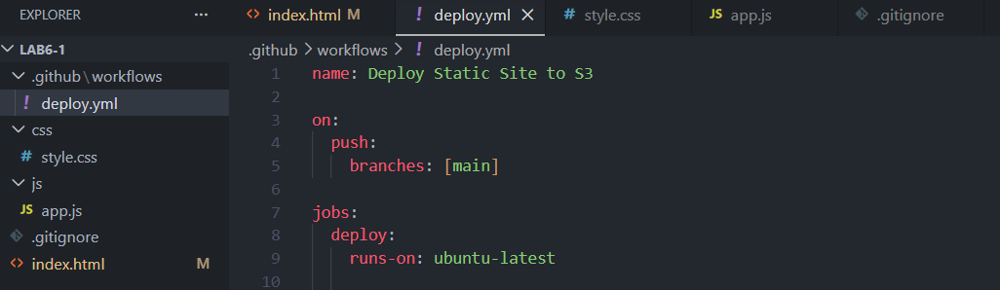
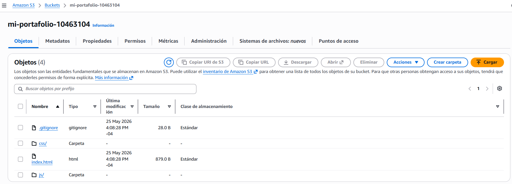
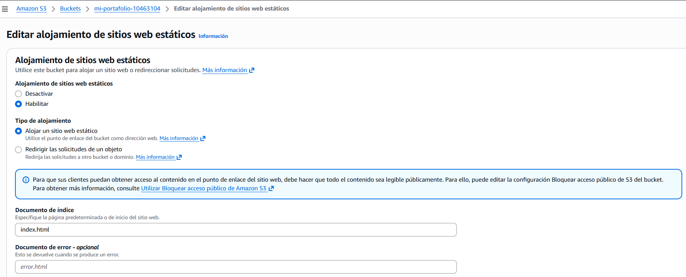
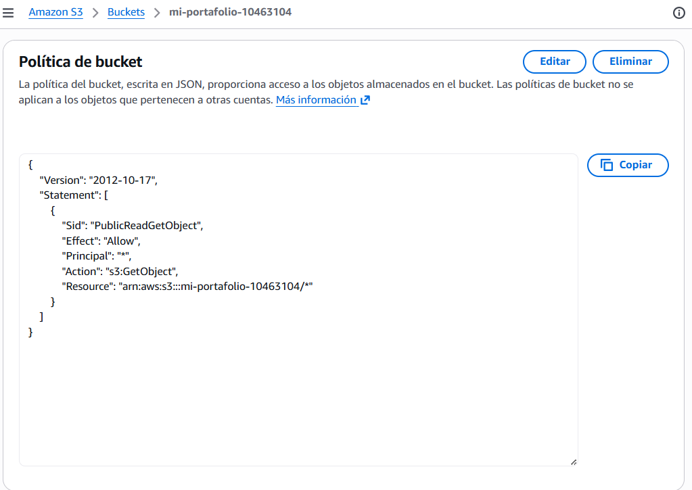
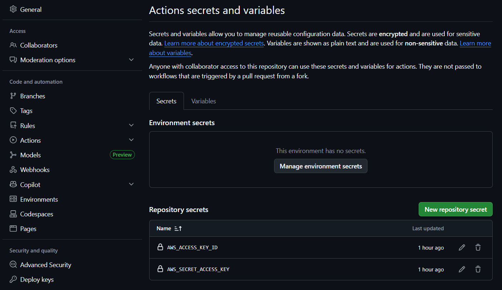
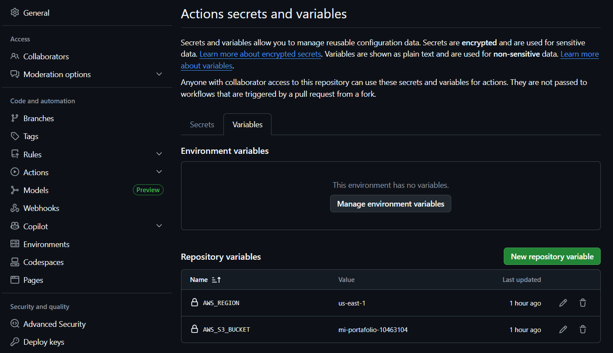
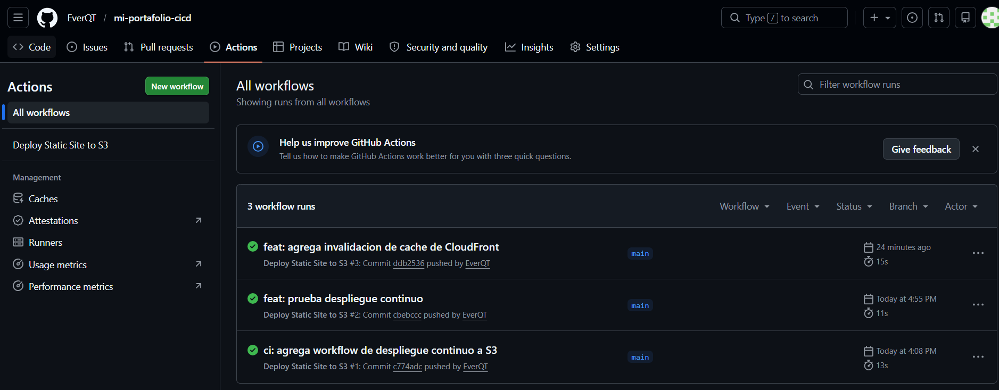
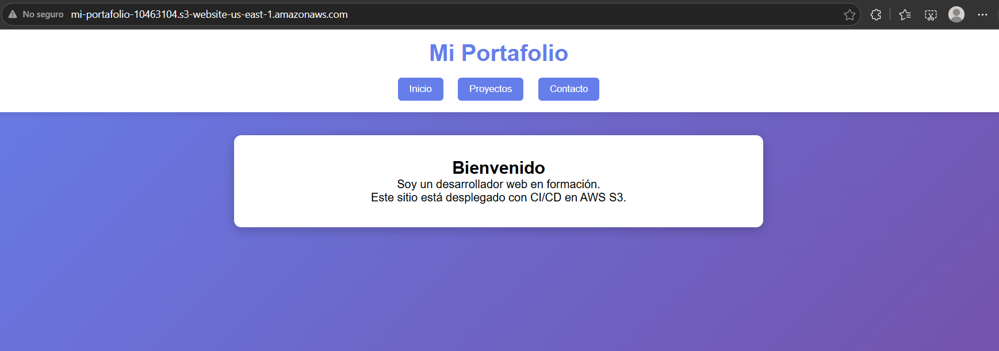
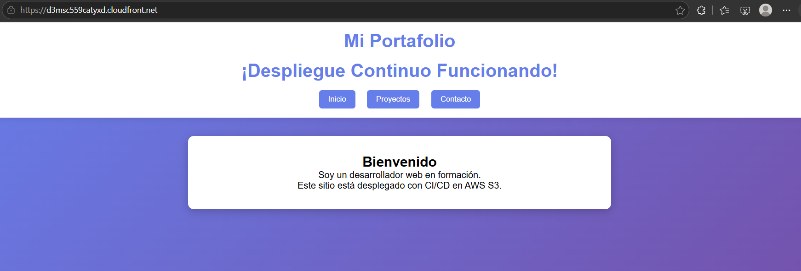
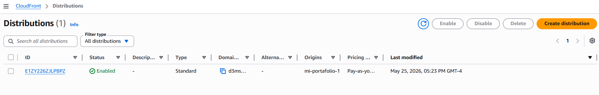

# Informe Laboratorio 6.1 - Despliegue CI/CD

## Datos del estudiante
- **Nombre:** [Tu nombre aquí]
- **Repositorio:** https://github.com/EverQT/mi-portafolio-cicd

## Descripción del sitio web
Portafolio personal con HTML, CSS y JavaScript. Incluye navegación entre secciones (Inicio, Proyectos, Contacto) y diseño responsivo.

## URLs de acceso
- **S3 (HTTP):** http://mi-portafolio-10463104.s3-website-us-east-1.amazonaws.com
- **CloudFront (HTTPS):** https://d3msc559catyxd.cloudfront.net

## Comandos utilizados en la terminal

```bash
# Crear estructura de carpetas
mkdir css js .github\workflows

# Crear archivos
echo > index.html
echo > css\style.css
echo > js\app.js
echo > .github\workflows\deploy.yml
echo > .gitignore

# Inicializar Git
git init

# Agregar archivos
git add .

# Crear commit
git commit -m "feat: portafolio personal con HTML/CSS/JS"

# Cambiar rama a main
git branch -M main

# Conectar a GitHub
git remote add origin https://github.com/EverQT/mi-portafolio-cicd.git

# Subir código
git push -u origin main

# Subir cambios posteriores
git add .
git commit -m "ci: agrega workflow de despliegue continuo a S3"
git push origin main
```

## Estructura del proyecto

```
lab6-1/
├── .github/
│   └── workflows/
│       └── deploy.yml
├── css/
│   └── style.css
├── js/
│   └── app.js
├── .gitignore
└── index.html
```

## Pipeline CI/CD

El workflow de GitHub Actions (`.github/workflows/deploy.yml`) realiza:
1. Checkout del código
2. Configuración de credenciales AWS
3. Sincronización con S3 (`aws s3 sync`)
4. Invalidación de caché de CloudFront

## Evidencias

### 1. Estructura del proyecto en VS Code


### 2. Bucket S3 con objetos


### 3. Hosting estático habilitado


### 4. Política de bucket pública


### 5. Secrets de GitHub


### 6. Variables de GitHub


### 7. Workflow exitoso en GitHub Actions


### 8. Sitio funcionando en S3


### 9. Sitio funcionando en CloudFront (HTTPS)


### 10. Distribución CloudFront configurada


## Prueba de despliegue continuo
Se realizó un cambio en el título del sitio de `¡Hola desde la Nube!` a `¡Despliegue Continuo Funcionando!`. El workflow se ejecutó automáticamente y el cambio se reflejó en menos de 2 minutos.

## Fallo y corrección
- **Fallo:** El workflow falló al agregar invalidación de CloudFront por falta de permisos.
- **Error:** `AccessDenied: not authorized to perform: cloudfront:CreateInvalidation`
- **Solución:** Se creó una política personalizada `CloudFrontInvalidationOnly` y se adjuntó al usuario IAM.

## Conclusiones
El despliegue continuo funciona correctamente. CloudFront mejora la seguridad con HTTPS y la invalidación de caché asegura que los cambios se vean inmediatamente.